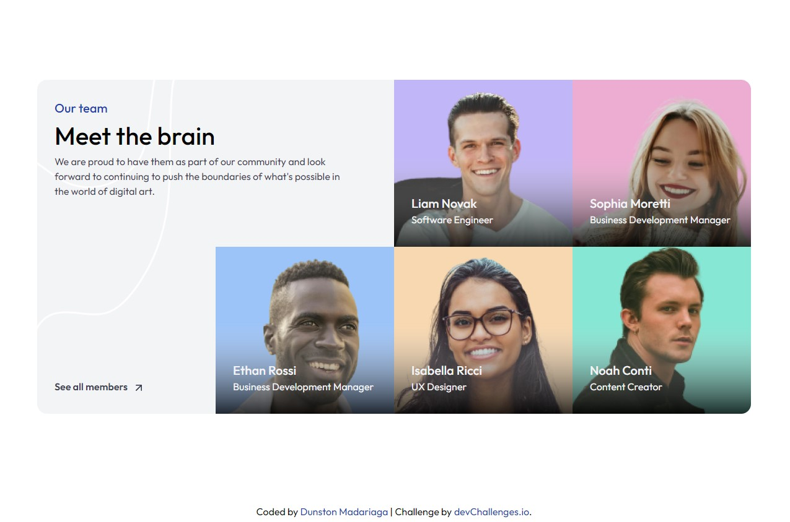

<!-- Please update value in the {}  -->

<h1 align="center">Meet the Team Section | devChallenges</h1>

   Solution for a challenge <a href="https://devchallenges.io/challenge/meet-the-team-section-challenge" target="_blank">Meet the Team Section</a> from <a href="http://devchallenges.io" target="_blank">devChallenges.io</a>.

  <h3>
    <a href="{https://your-demo-link.your-domain}">
      Demo
    </a>
     | 
    <a href="{https://your-url-to-the-solution}">
      Solution
    </a>
     | 
    <a href="https://devchallenges.io/challenge/meet-the-team-section-challenge">
      Challenge
    </a>
  </h3>

<!-- TABLE OF CONTENTS -->

## Table of Contents

- [Overview](#overview)
  - [What I learned](#what-i-learned)
- [Built with](#built-with)
- [Features](#features)
- [Author](#Author)

<!-- OVERVIEW -->

## Overview

### What I learned

This was a good challenge to test my current level of css, it took longer than I wanted but it was a good challenge.
I've also learned how to send the footer down without having to.

### Built with

- Semantic HTML5 markup
- Flexbox
- CSS Grid
- [Tailwind](https://tailwindcss.com/)

## Features

This application/site was created as a submission to a [DevChallenges](https://devchallenges.io/challenges-dashboard) challenge.

## Author

- Website [your-website.com](https://devchallenge-meet-the-team-section.netlify.app)
- GitHub [Pogo182028](https://github.com/Pogo182028)
